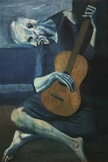

====
Arte
====

Cubismo
=======

Il Cubismo è un periodo in cui alcuni pittori usavano le forme
Geometriche per rendere l'immagine realistica, si divide in 3 periodi:

1. **Cubismo formativo** in questo gli artisti semplificano geometricamente le forme portandole a puri volumi, nasce a Parigi per opera di **Picasso** e **Braque.**

2. **Cubismo analitico** in questo viene ritratto un oggetto da più punti di vista, e quindi viene l’immagine di varie figure che si intersecano. Il dipinto a questo punto non è più un'imitazione       della realtà ma diventa **un vero e proprio oggetto.**

3. **Cubismo sintetico** in questo il livello di realismo viene alzata dal **collage polimaterico** tipo di arte in cui per creare un collage si usano vari tipi di materiali.

Pablo picasso
=============

**Pablo picasso** nacque a Malaga nel 1881, in Spagna, il padre
insegnante nella locale scuola d’arte lo avviò precocemente
all’apprendistato artistico. A soli quattordici anni venne ammesso
all’Accademia di **Belle Arti di Barcellona**, due anni dopo si trasferì
**all’Accademia di Madrid**. Successivamente ritornò a Barcellona,
**effettuò il suo primo viaggio a Parigi nel 1900**, e vi ritornò più
volte, fino a stabilirsi definitivamente.

Dal 1901 lo stile di Pablo picasso iniziò a mostrare dei tratti
originali.

Ebbe inizio il cosiddetto **«periodo blu»** che si protrasse fino al
1904. Il nome a questo periodo deriva dal fatto che usava dipingere in
maniera monocromatica, utilizzando prevalentemente il blu in tutte le
tonalità e sfumature possibili. I soggetti erano soprattutto poveri ed
emarginati, Picasso li ritrae preferibilmente a figura intera, in
posizioni isolate e con aria mesta e triste. Ne risultavano immagini
cariche di tristezza, accentuata dai toni freddi (blu, turchino, grigio)
con cui i quadri erano realizzati.

Dal 1905 e fino alla fine del 1906, Picasso schiarì la sua tavolozza,
utilizzando le gradazioni del rosa che risultano più calde rispetto al
blu. Iniziò quello che, infatti, viene definito il **«periodo rosa»**,
nello stesso periodo, come molti altri artisti del tempo, anche Picasso
si interessò alla **scultura africana**, che aveva suggestionato molta
cultura artistica europea da **Gauguin** in poi.

Da questi incontri, e dalla volontà di continua sperimentazione che ha
sempre caratterizzato l’indole del pittore, nacque nel 1907 il quadro
**«Les demoiselles de Avignon»** che segnò l’avvio della stagione
cubista. Successivamente tornò a Parigi dove incontrò **Braque** con il
quale diede inizio alla corrente artistica del **cubismo.**

Il vecchio chitarrista cieco
============================

Il vecchio chitarrista cieco è un dipinto a olio su tavola realizzato nel 1903 dal pittore spagnolo Pablo Picasso.
È conservato nel "The Art Institute di Chicago".

In questo quadro vediamo un vecchio e
cieco mendicante su di un marciapiede intento a suonare una chitarra che
nel quadro occupa più spazio di lui e si contrappone nella sua rotondità
ai tratti duri e alla magrezza del vecchio. Possiamo vedere che il
mendicante non riesce a suonare con disinvoltura, frustrato da un lungo
periodo di pene per la sua condizione.

L’unica cosa che da un pò di speranza nel quadro è la chitarra che copre
parte dell’esile corpo del mendicante.

Il nome **Cubismo** nasce da una recensione di un giornale francese ad
un quadro di Braque, in modo scherzoso, per via della presenza di
**cubi**.
