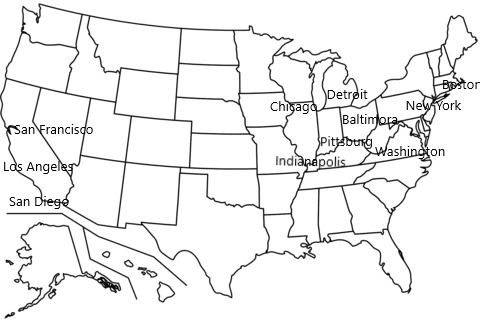

=========
Geografia
=========

Gli **Stati Uniti** si trovano in **Nord America** e sono conosciuti per
la loro vasta ed efficiente economia, infatti sono la prima potenza per
il valore delle merci prodotte, reddito complessivo degli abitanti, per
innovazione tecnologica, ricerca, per denaro accumulato nelle banche e
per il valore degli scambi commerciali.Anche per questo gli USA
esercitano un forte **potere nell’economia e nella vita politica degli
altri stati**.

1. Nel settore primario quasi il 50% del territorio statunitense è
   destinato all’agricoltura e la produzione è elevatissima, grazie
   all’uso di metodi di coltivazione moderni. **E sono al primo posto
   per la coltivazione di mais e soia.**

2. Il settore secondario è favorito dall’abbondanza di materie prime
   come il carbone, il petrolio, rame, oro e argento.Prevalgono **le
   grandi industrie manifatturiere**. Negli ultimi anni nelle industrie
   tessili, meccaniche e quelle di elettronica sono stati diminuiti gli
   addetti per via della **delocalizzazione** ,cioè sono state spostate
   in paesi più poveri per la manodopera a basso costo.Inoltre ad
   **Hollywood** (città di Los Angeles) ci sono **case discografiche e
   cinematografiche.**

3. Il settore Terziario e composto soprattutto dalle agenzie che
   impostano i motori di ricerca come quello di **Google** o ancora Il
   **settore dei servizi** in cui possiamo citare la borsa più
   importante al mondo cioè **la borsa di New York** che rimane
   importante nonostante la grande importanza che sta acquistando
   l’euro.

La Popolazione
==============

La popolazione è concentrata in megalopoli che sono:

-  **La Megalopoli Atlantica** che comprende Boston, New York, Baltimora
   e la capitale **Washington**.

-  **La Megalopoli della regione dei laghi** che comprende Chicago,
   Detroit, Pittsburg e Indianapolis.

Il popolamento sulla costa occidentale invece è avvenuto dopo la
colonizzazione ma comunque ci sono città con molti abitanti come **Los
Angeles** che è formata da vari centri i più conosciuti sono :
Hollywood, Santa Monica, Malibu e Beverly Hills. Oltre Los Angeles
abbiamo anche San Diego e San Francisco.

La forma di governo negli USA è la repubblica federale cioè sono divisi
in vari piccoli stati indipendenti per il commercio interno ed il
governo per il commercio esterno devono tener conto di un governo che
riguarda tutto lo stato, ed è formato da 50 stati.

Non lontano dagli USA , nelle acque dell’Oceano Atlantico possiamo
trovare un’isola molto conosciuta che è **Cuba** , in quest’isola
nacquero due diversi tipi di balli il **Boleros** e il **Mambo**.
