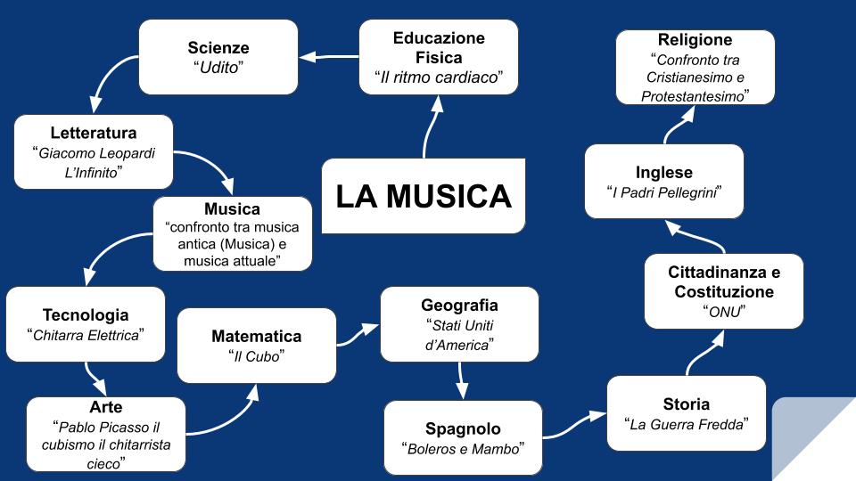

========================
La Musica
========================
La musica è sempre stata parte integrante della nostra vita, per questo si possono trovare tracce di essa in ogni circostanza.Riesce a farci provare emozioni che una persona in carne ed ossa non riuscirebbe a fare.

La musica è magia, riesce a trasportarci con l’anima e la mente in situazioni passate della nostra vita facendocele rivivere con la stessa intensità.

La musica è anche una forma di linguaggio universale dove non esistono distinzioni di razza, di genere, di età o di sesso, ma esiste soltanto qualcuno che suona e qualcuno che ascolta.

Ed è proprio la musica che ho scelto come argomento d’esame e filo conduttore degli argomenti che tratterò.

Ne parlerò tenendo conto di ogni suo aspetto e comincio col dire che la musica ce l’abbiamo dentro di noi: perché il nostro cuore, infatti, per trasportare il sangue in tutto il corpo ha bisogno di impulsi che arrivano secondo un ritmo, il “Ritmo cardiaco”. 

Pensate che se proviamo a tappare le orecchie con le mani riusciamo a sentire il nostro battito questo grazie all’Udito.

Un autore letterario che noi conosciamo molto bene si divertiva a dare un ritmo alle sue poesie e sto parlando di Giacomo Leopardi e, in particolare, di una sua bellissima poesia, “L’Infinito”. Questa poesia, proprio come la musica, può essere interpretata in infiniti modi pur non conoscendo il vero significato che l’autore intende attribuire alle parole, così come fa Leopardi nell’immaginare l’orizzonte.

Col passare degli anni arriviamo ad una fusione della musica con il teatro, da qui “il musical” di cui farò un confronto con la musica leggera che noi ascoltiamo attualmente. 
Uno strumento molto presente nelle musica leggera è la chitarra elettrica, che è sempre stato uno strumento iconico, un esempio è rappresentato da un quadro chiamato “Il vecchio chitarrista cieco” dipinto da Pablo Picasso che diede inizio ad una nuova corrente artistica chiamata il Cubismo.

Il nome Cubismo fu attribuito a questa corrente artistica dalla stampa Parigina in una recensione del dipinto di Braque in cui c’era una forte presenza di cubi,  a proposito di cubi parlando di cubi molto famoso cioè il cubo di Rubik e un musicista chiamato Michael Staff.  
Michael Staff vive a New York, che si trova negli Stati Uniti d’America, e proprio nel 51°stato degli USA, cioè Cuba, sono nati due balli molto famosi il Boleros e Il Mambo.

Proprio a Cuba ci fu un’importante crisi durante la Guerra Fredda dove si è rischiato di scatenare una guerra, nonostante la presenza dell’ONU.Gli immigrati ci sono sempre stati infatti possiamo parlare dei Padri Pellegrini che per via di una persecuzione hanno dovuto lasciare la loro terra, i Padri Pellegrini erano perseguitati per la loro religione e qui farò un confronto tra la loro religione ( protestantesimo ) e la nostra. 

**“La musica è come la vita, si può fare in un solo modo: insieme.” cit. Ezio Bosso** 

**Mappa Concettuale**

.. toctree::
   :maxdepth: -1

   scienze_motorie
   scienze
   letteratura
   musica
   tecnologia
   arte
   matematica
   geografia