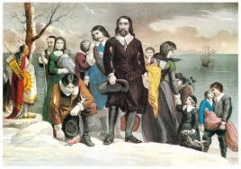

=======
Inglese
=======

Everyone does not know that the first who landed in America were the
**Pilgrim Fathers**.They sail from Plymouth in England on a ship called
**The Mayflower**. They want to move in a new land where they can
profess their faith free from persecution. They cross the Atlantic Ocean
and they land on the east coast of **America** on November the
10\ :sup:`th`. They call the land “New England”. They arrive in
Massachusetts in winter. Winter is very cold in the new land and there
isn’t any food. The Indians help the Pilgrims and give them **turkeys**
and **pumpkins**. The Indians teach them how to grow **maize** and
**beans** for the next **harvest**. After a good harvest, in the autumn
of 1621, the Pilgrims thank the Indians. They make a **feast** of turkey
and pumpkins and invite the Indians. They also **pray** and **thank
God**.

The Americans still celebrate this feast on “\ **Thanksgiving Day**\ ”.
In the USA, Thanksgiving is a national holiday. Americans celebrate on
the fourth Thursday in November. People go to **church** and have a
family dinner with **roast turkey**, **potatoes** and **pumpkin pie.**

Their story is very important in the history and culture of the United
States.The Pilgrim or Pilgrim Fathers, were a religious group of English
people.They first went from England to the Netherlands.Then one hundred
and two pilgrims travelled from Holland to North America on the ship
**Mayflower**. They wanted to establish a new colony in North America.
It wasn’t easy, and they had many problems with diseases. They didn’t
have enough food to feed all of the colony, but the **Wampanoag Native
Americans** helped them by giving them how to fish. In 1620, the
Plymouth Colony (now in Massachusetts) become the second successful
English settlement. Pilgrim Fathers were forced to leave their land
because they were persecuted for their religion which is
**Protestantism** other than that of their fellow citizens.
