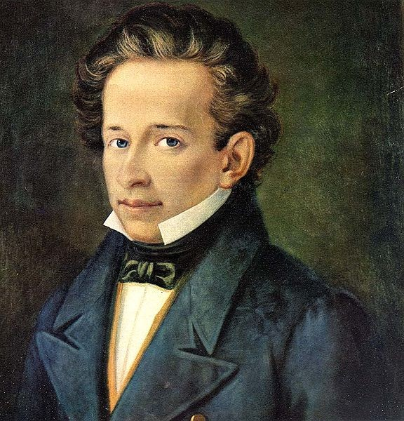

============
Letteratura
============
Giacomo Leopardi fu uno degli scrittori più importanti della letteratura italiana.
Lui fu un animo sensibile e molto inquieto, ed era molto conosciuto per la sua capacità di pensare e ragionare in versi, 
infatti veniva chiamato “pensiero poetante”.Lui riusciva ad osservare con attenzione e in modo critico la mente dell’uomo 
ma allo stesso modo riesce a tirare il suo essere poeta.
È difficile classificarlo in una corrente letteraria perché lui come forma preferiva la forma tradizionale ma è stato anche uno dei poeti 
più romantici di cui abbiamo studiato, perché lui nelle sue poesie fa provare emozioni forti e indimenticabili come la gioia di vivere.

La vita di Giacomo Leopardi
===========================
Leopardi nasce a Recanati, un piccolo paese delle marche, nel 1798 dal conte Monaldo e dalla marchesa Adelaide Antici.
Il padre è sempre stato molto severo anche per le cose più banali, mentre la madre era ossessionata dalla religione e oppressiva con i figli.          
Leopardi a 9 anni fu affidato a un precettore in modo che lo seguisse con gli studi.
Lui fin da piccolo mostrò il suo talento, infatti ben presto iniziò a studiare da solo grazie alla grande libreria del padre, 
e imparò varie lingue come:il Latino, il Greco, lo Spagnolo o anche l’Ebraico.
Ma purtroppo il troppo studio lo portò ad avere la scoliosi ed avere problemi con gli occhi.
Lui si sentiva così tanto oppresso nell’ambito familiare che nel 1819 all'età di 21 anni tentò di scappare, 
ma fallì e da li e per i prossimi 3 anni attraversò un lungo periodo di solitudine.Fino al 1822 quando si trasferì dallo zio a Roma 
sia per un suo interesse nell'entrare nel mondo degli intellettuali sia per intraprendere una carriera ecclesiastica, 
però dopo poco Leopardi tornò a casa deluso dall’ignoranza che aveva visto a Roma, 
oltre che a Roma Leopardi visse a Milano, Bologna, Firenze e Pisa ma per problemi di salute tornò ancora una volta nella casa paterna.
Nel 1830 con l’aiuto di amici si stabilì a Firenze dove soffri per amore non corrisposto da Fanny Targioni Tozzetti.Nel 1833 si 
trasferì a Napoli sperando che l’aria mite del meridione lo avrebbe aiutato con i problemi si salute, 
così si trasferì dall’amico Antonio Ranieri.Leopardi morì nel 1837 a  Napoli a soli 39 anni.Morì precisamente nella casa di Vico Pero, 
Quartiere Stella.Lui Morì per  «idropericardia» e non per colera come molti pensano.

Il pensiero di Giacomo Leopardi
===============================
Leopardi fin dalla sua tenera età si sentì incompreso in quella che era la sua famiglia e fin da subito si immerse nello studio.
Molte volte fu deluso ma quella che ricordiamo tutti è quando andò a Roma per entrare nel mondo degli intellettuali ma rimase 
deluso nel vedere che c’era anche lì molta ignoranza.

Ma da questa delusione ebbero inizio  le famosissime fasi di pessimismo di Leopardi 

- **Fase del pessimismo individuale**:in questa fase Leopardi pensa di essere destinato all’angoscia e crede che l’unica che potesse fare era la contemplazione della natura.In questa fase scrisse l’Infinito (poesia che andremo a trattare dopo).
- **Fase del pessimismo storico**:in cui sostiene che tutti siamo infelici perché la felicità era nella spontaneità e nell'ingenuità dell'uomo primitivo o nel periodo della fanciullezza. durante questo periodo scrisse Il sabato del villaggio e La sera del dì di festa chiari esempi di nostalgia.
- **Fase del pessimismo cosmico**:Leopardi dice che è la ragione il motivo dell’infelicità e che sia la natura stessa a farci desiderare sempre di più di quello che abbiamo.Che muove gli uomini in un mondo fatto solo da creazione e distruzione.
- **Fase del pessimismo eroico**: in questa ultima fase Leopardi rivaluta la ragione  e la reputa un modo per non essere ingannati dalla natura.E anche per permetterci di vivere senza illusioni e sapere che possiamo condividere con gli altri dolore e morte.

Queste sono le 4 fasi del pessimismo ma nell’ultimo periodo della sua vita, in cui era a Napoli, iniziò a pensare che l’unico modo per combattere l’infelicità sia la fratellanza e la solidarietà tra gli uomini.E espose questa sua teoria nella  poesia La ginestra 1836 (fiore che si trova sul vesuvio).

Opere Giacomo Leopardi
======================
Giacomo Leopardi scrisse due tipi di testi le canzoni e i piccoli idilli.
Quando ebbe la delusione di Roma abbandono le rime e scrisse i grandi idilli.Idilli deriva dal greco e vuol dire “quadretto” e in questo si rappresentavano due contadini intenti a parlare tra loro con attorno un paesaggio rurale.Grandi e piccoli idilli sono raccolti nel libro dei Canti.E inoltre Leopardi ha scritto un diario lo Zibaldone in cui ci ha fatto capire la sua strana personalità poco classificabile.

Linguaggio Giacomo Leopardi
===========================
Leopardo considerava la poesia come Musica infatti usava il metro libero e dava un ritmo alle sue poesie arricchendole di un  valore educativo.Usava vocaboli di uso comune affiancandoli da vocaboli colti e ricercati.

L’Infinito
==========
Infinito fa parte dei piccoli idilli leopardiani ed è stato scritto nel 1819, quando il poeta si era nella fase di pessimismo individuale.Lui parla di un colle a Recanati che gli trasmetteva tranquillità  a livello mentale e l’aiutava a riflettere.Il testo formato da quindici endecasillabi è ritenuto il più importante che Leopardi abbia mai scritto.Leopardi nei suoi poemi riesce ad esprimere sempre i suoi sentimenti e ci riesce anche cui, esprimendo un senso di tranquillità e di immenso.L’indefinitezza è sottolineata in questa poesia.Leopardi torna su un colle, per guardare l’orizzonte, ma dinanzi a sé c'è una siepe che funge da ostacolo, così lui inizia a vagare con ‘immaginazione. Quindi il suo infinito si attribuisce alla fantasia.

Poesia e parafrasi
==================

Testo
-----

.. code-block:: python

    Sempre caro mi fu quest’ermo colle, 

    e questa siepe, che da tanta parte

    dell'ultimo orizzonte il guardo esclude.

    Ma sedendo e mirando, interminati

    spazi di là da quella, e sovrumani

    silenzi, e profondissima quiete

    io nel pensier mi fingo; ove per poco

    il cor non si spaura. E come il vento

    odo stormir tra queste piante, io quello

    infinito silenzio a questa voce

    vo comparando: e mi sovvien l'eterno,

    e le morte stagioni, e la presente

    e viva, e il suon di lei. Così tra questa

    immensità s'annega il pensier mio:

    e il naufragar m'è dolce in questo mare.

Parafrasi
---------
Questo colle solitario mi è sempre stato caro, e cara mi è sempre stata questa siepe che impedisce la vista di una larga parte della linea dell'orizzonte. Ma sostando e guardando davanti a me, mi figuro con l'immaginazione spazi sconfinati oltre quella siepe e silenzi sconosciuti all'umanità e una immensa quiete; e davanti a questi pensieri il mio cuore è sul punto di smarrirsi. E non appena sento il vento frusciare tra le foglie delle piante, io confronto quell'infinito silenzio alla voce del vento: e mi vengono in mente l'eternità, il tempo passato e la stagione presente e viva e la sua voce. Così il mio pensiero sprofonda in questa immensità e in essa si annega: e il sentirmi naufragare provoca in me una sensazione di dolcezza.

Commento
--------
La poesia mi trasmette un senso di tranquillità e di immensità ed è quasi se potessi vedere anche io nella sua immaginazione.

Andando un pò avanti con gli anni possiamo assistere alla nascita di una parte della musica che io personalmente amo cioè il musical.

