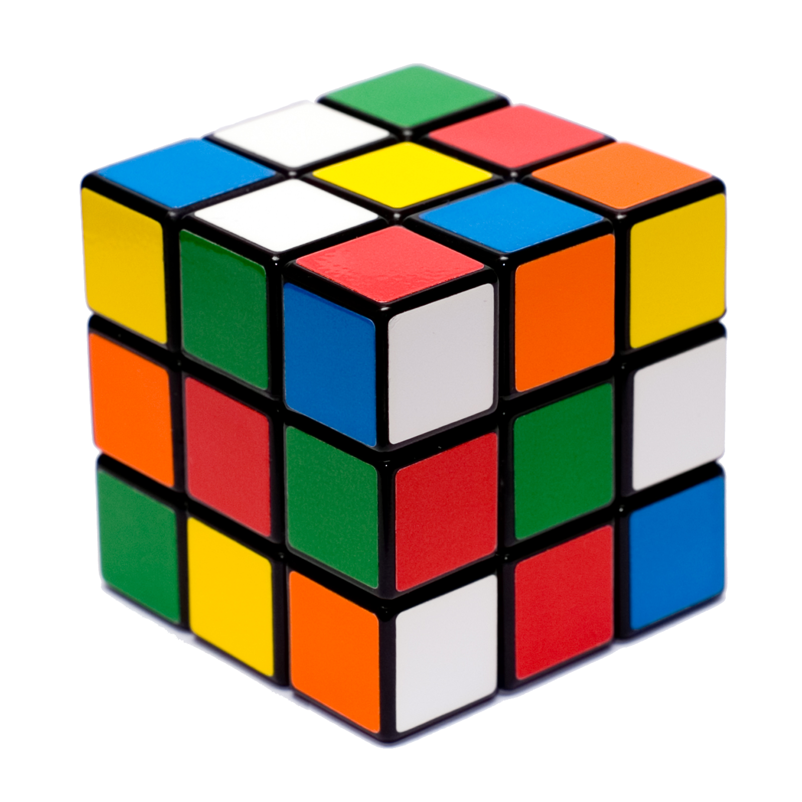

==========
Matematica
==========

Il cubo è una figura solida cioè formata dalle 3 dimensioni:\ **altezza,
larghezza e volume**.Questa figura è formata da 6 quadrati messi
insieme.

Formule
=======

Ab =AB\ :sup:`2`     AB=\ :math:`\sqrt[2]{Ab}`

Al=4xAB\ :sup:`2`    AB=\ :math:`\sqrt[2]{Al}`\\ 4

At=Ab x 2 + Al       

Ab=At-Al\\2       Al=At-Abx2

V=AB\ :sup:`3`       AB=\ :math:`\sqrt[3]{V}`

Il cubo di Rubik
================

Un cubo che noi conosciamo molto bene è **il cubo di Rubik** un
rompicapo il quale per risolverlo bisogna rendere ogni faccia di un solo
colore. A volte si pensa che si deve girare a caso me non è così.
Infatti grazie alla musica e alla teoria degli insieme si riesce a
risolverlo molto più facilmente. Un gruppo però deve seguire 4 regole
che sono:

-  ogni operazione è riservata solo dagli oggetti che li compongono, nel
   cubo possiamo dire che qualsiasi movimento fai ti ritroverai sempre
   il quadratino che faceva parte del gruppo.

-  non importa dove metti le parentesi in un’operazione il risultato è
   sempre lo stesso, quindi se nel cubo lo giri nella stessa direzione
   prima 2 e poi 1 volta o viceversa il risultato è sempre lo stesso.

-  ogni gruppo contiene **un'identità** questo membro se addizionato ad
   ogni membro del gruppo da sempre come risultato quest’ultimo perché
   l’identità equivale a 0.

-  In ogni gruppo c’è anche un altro elemento che si chiama **inverso**
   ed è l’elemento che si annulla con l’identità.

Ma ora guardiamo queste regole dal lato che ci interessa.

Infatti queste teorie sono profondamente radicate nella musica, infatti
molte volte i musicisti per creare una melodia prendono le **12 note e
creando un quadrato**.L’accordo che ne deriva è un accordo di settima
diminuito.E questo è un gruppo nel quale l’unica operazione è spostare
la nota di sotto in alto.Il musicista **Michael Staff** disse che se si
mette una nota che fa parte del gruppo quindi si può risolvere creando
una melodia.Inoltre Michael Staff vive tuttora a New York negli **Stati
Uniti**.

