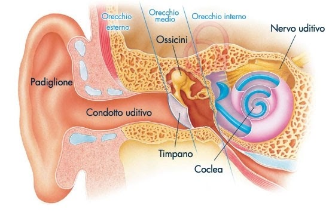

=======
Scienze
=======
L’udito è uno dei nostri 5 sensi insieme al gusto, al tatto, la vista e l’olfatto, e noi utilizziamo l’udito attraverso l’orecchio, 
l’udito è il primo dei 5 sensi ad essere sviluppato infatti a soli tre mesi riusciamo a percepire le onde sonore.

L’orecchio ci permette di, attraverso dei recettori, captare delle onde sonore questo anche grazie all’apparato uditivo 
che ci aiuta a percepire le onde sonore e a differenziare, grazie al nervo uditivo, l’intensità, la potenza e il volume.
Oltre ciò l’orecchio permette di mantenere l'equilibrio quindi non fa sbilanciare i muscoli ne quando sono in movimento ne quando sono fermi.
L’orecchio si divide in :  `Orecchio esterno`_, `Orecchio medio`_ e `Orecchio interno`_.    

Orecchio esterno
================
- **Il padiglione auricolare** che oltre a fungere da protezione per l’orecchio medio li intrappola le onde sonore e le trasporta verso l’interno, attraverso un labirinto fatto di solchi e pieghe costituiti da cartilagine rivestita da pelle.
- **Il condotto uditivo esterno** che è un condotto che porta le onde sonore verso il **Timpano** una membrana che vibra quando viene raggiunta dalle onde sonore. E questo è il limite tra orecchio esterno e medio. Inoltre vicino al timpano ci sono le ghiandole del cerume che serve come protezione per il timpano.

Orecchio medio
==============
L’orecchio medio inizia col timpano una membrana sottilissima che vibra e capta le onde sonore e ne stabilisce l’intensità.
Inoltre ci sono anche la fila dei tre ossicini il **martello, incudine e staffa** questi tre portano alla chiocciola o anche detta coclea le vibrazioni.
Inoltre l’orecchio medio è collegano alla faringe attraverso la **tromba di Eustachio**, 
che difende il nostro orecchio da pericolosi e improvvisi cambiamenti di pressione.

Orecchio interno
================
Di questo l’organo più importante è la coclea e  suoi canali semicircolari.
La coclea o chiocciola è formata da varie cavità chiamate rampe, in queste scorre un liquido l'endolinfa, in questa viaggiano delle vibrazioni che arrivano al fulcro dell organo uditivo.
Le vibrazioni arrivano all'organo del Corti dove ci sono varie ciglia di diversa lunghezza che raccolgono le vibrazioni .
E infine ci sono i canali semicircolari in cui ci sono i  recettori dell'equilibrio. In questi ci sono dei cristalli che vengono stimolati da membrane ciliate.

Funzionamento dell’orecchio
===========================
Le vibrazioni che vengono prese dal padiglione dell’orecchio vengono trasportate fino al timpano dove poi passano al timpano interno e attraverso 
il movimento dei tre ossicini arrivano dell'endolinfa, arrivano all’organo del Corti che prende le vibrazioni e lungo il nervo acustico 
arrivano al cervello.Una volta nel cervello nella zono che capta le vibrazioni e li rende suoni che provocano sensazioni.
Molte cose, apparte le canzoni, a noi paiono orecchiabili come filastrocche, scioglilingua oppure poesie.
Io ricordo un autore a cui piaceva dare un ritmo alle sue poesie, :doc:`Giacomo Leopardi<letteratura>`.
