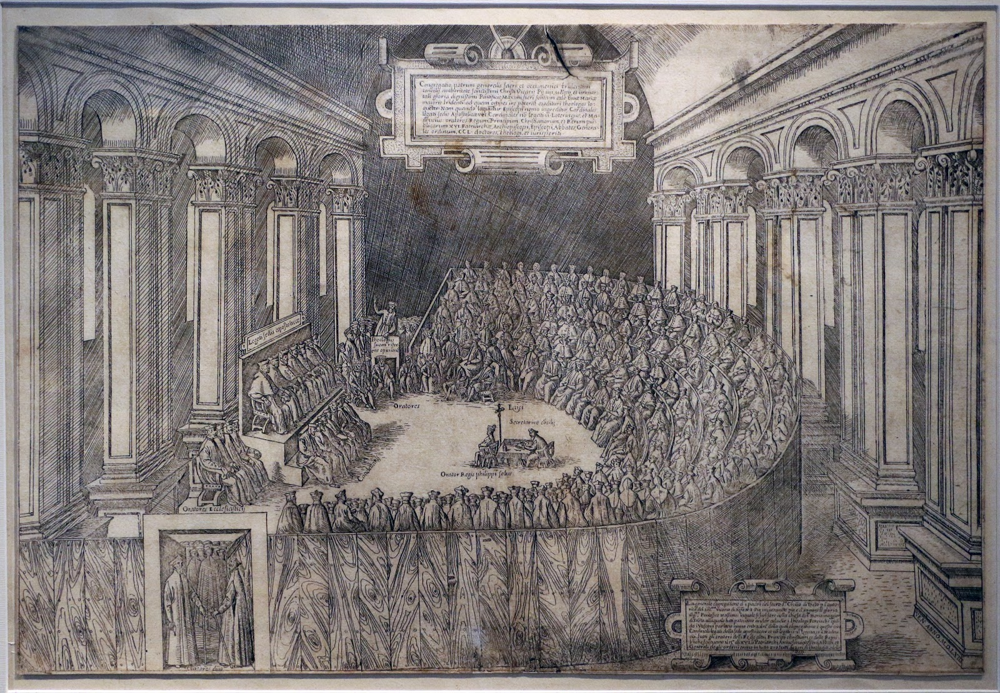

=========
Religione
=========

Protestantesimo
===============

La Riforma luterana ha inizio nell'ottobre del 1517, con la
pubblicazione delle 95 tesi del monaco agostiniano Martin Lutero, che
secondo la tradizione, affisse sul portone della Cattedrale di
Wittenberg.

Attraverso questo scritto, egli si scaglia contro lo scandalo della
compravendita di indulgenze: è questa un'occasione per condannare
moralmente anche l'atteggiamento dei Papi, che all'epoca vivevano come
re.

Il Cristianesimo, secondo Lutero, va riformato sulla base di tre
principi fondamentali:

1. il libero esame, ovvero la possibilità e la libertà per ogni cristiano di leggere e interpretare autonomamente la Bibbia;

2. il sacerdozio universale, secondo il quale tutti sono responsabili della propria fede e non la demandano a nessun altro;

3. salvezza che dipende solo dalla fede, annullando quindi l'importanza delle opere, ovvero le offerte alla Chiesa.

Il conflitto di **Martin Lutero** non è più dunque soltanto morale, ma
anche teologico.

**Il Concilio di Trento** fu molto importante per la Chiesa Cattolica
perché servì a riaffermare i suoi princìpi (che Lutero aveva contestato
con le sue Tesi) e per rivitalizzare la propria immagine che si era
andata offuscando in molte parti d'Europa.

Come dicevamo il concilio durò per ben 18 anni, con varie interruzioni,
e si articola in 3 fasi:

1. La Germania, dopo la scomunica di Lutero, aveva chiesto al Papa un
   concilio ecumenico, che Papa Clemente VII non si decideva a
   convocare. Il suo successore, Paolo III, era invece convinto che
   la riforma della Chiesa Cattolica potesse avvenire solo dopo un
   concilio che infatti fu indetto e finalmente inaugurato il 13
   Dicembre 1545 a Trento.In questa prima fase il Concilio si occupò
   delle grandi questioni teologiche.

2. Intanto era diventato Papa Giulio III.
   A questa fase del concilio parteciparono inizialmente anche alcuni
   vescovi riformati provenienti dalla Germania, ma il tentativo di
   conciliazione non portò a nulla perché non si arrivò ad un
   compromesso fra le posizioni di cattolici e protestanti.

   Furono quindi riprese le questioni sui sacramenti e si parlò
   soprattutto di Eucaristia.

   I lavori si interruppero nuovamente per la guerra tra Carlo V e
   Enrico II .

3. In quest'ultima fase si susseguirono vari pontefici: Paolo IV
   pubblicò nel 1559 l'Indice dei Libri Proibiti e poi, con Papa Pio
   IV, si arrivò alla conclusione definitiva del Concilio.
   Nell'ultima fase si discusse soprattutto dell'obbligo per i Vescovi
   di risiedere presso la diocesi di appartenenza e di alcune questioni
   legate agli obblighi dei prelati.

Martin Lutero
-------------

Martin Lutero (1483-1546) era di origine contadina, dopo essere
diventato monaco agostiniano intraprese studi teologici e divenne nel
1513 professore a Wittenberg. Nella continua ricerca di una fede più
profonda e sincera si scontrò presto con le autorità della chiesa.

Nel 1517 Lutero affisse sulla porta di una chiesa a Wittenberg (nella
Turingia) 95 tesi contro la corruzione nella chiesa e in particolare
contro il commercio delle indulgenze che all'epoca era molto di moda. Il
perdono dei peccati era, alla sua epoca, praticamente in vendita: per
una certa somma di denaro ci si garantiva l'entrata in paradiso.
Esistevano delle tariffe ben precise per i vari peccati che variavano
anche rispetto allo stato sociale del soggetto. Lutero si ribellò
energicamente contro questa commercializzazione della fede. Dopo essersi
rifiutato di ritrattare le sue opinioni, Lutero giunse a negare
l'infallibilità del Papa e diede così, senza volerlo, inizio a uno
sconvolgimento religioso e politico che spaccò in due la chiesa e
l'Europa.

Molti regnanti della Germania e di altri paesi sfruttarono la divisione
religiosa per motivi politici, in Germania iniziò un periodo di guerre
che ebbero anche un'influenza molto importante per la formazione
dell'assetto politico dell'Europa moderno.

+------------------------------------------------------------------------------------------+----------------------------------------------------+
|**Cattolicesimo**                                                                         |  **Protestantesimo**                               |
+------------------------------------------------------------------------------------------+----------------------------------------------------+
|Credono nei santi                                                                         |  Non credono nei santi                             |
+------------------------------------------------------------------------------------------+----------------------------------------------------+
|Credono che per interpretare la Bibbia serva un parroco o qualcuno che fa parte del papato| Credono che la Bibbia si debba interpretare da soli|
+------------------------------------------------------------------------------------------+----------------------------------------------------+
|Credono esista il purgatorio                                                              |  Non credono che esista il purgatorio              |
+------------------------------------------------------------------------------------------+----------------------------------------------------+
