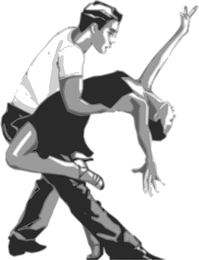

========
Spagnolo
========
Los **Boleros** nacen en Cuba para hablar de pasiones y desengaños….en
definitiva, de los problemas del amor.

En Cuba nace también el **mambo**, que no tiene nada que ver con las
letras románticas y las melodías de los boleros.

El mambo nace de la mezcla de los ritmos afrocubanos y la
instrumentación del jazz.

Con sus **ritmos alegres** y pegadizos, se populariza en los años 50
para extenderse a todas las pistas de baile de occidente.

En cuba hubo una crisis muy importante y peligrosa durante la Guerra
Fredda.
