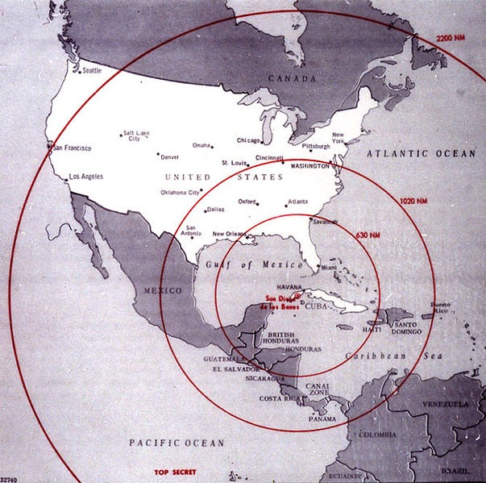

=======
Storia
=======
La guerra fredda è molto particolare poiché non si arrivò mai ad un
confronto armato.

Questa è durata **dalla fine della seconda guerra mondiale fino al
1989**, anno della caduta del muro di Berlino.

Le protagoniste di questa guerra sono due super potenze, uscite
vincitrici della seconda guerra mondiale cioè: **Stati Uniti e URSS**,
per mantenere il nuovo ordine mondiale contribuirono alla nascita di una
nuova organizzazione denominata **ONU**.

Uno degli eventi più importanti di questa guerra è stata la cosiddetta
crisi dei missili di Cuba.

**Il 27 ottobre 1962** fu il giorno in cui la crisi raggiunse il suo
apice, e il mondo fu a un passo dalla guerra nucleare tra Stati Uniti e
Unione Sovietica.

Tutto era iniziato alcuni mesi prima, quando l’Unione sovietica aveva
installato alcuni missili, capaci di trasportare testate nucleari,
sull’isola di **Cuba**, a meno di 150 chilometri dalle coste della
Florida e in grado quindi di colpire tutte le città della costa
orientale degli Usa (a cominciare da **New York** e **Washington**).

L’inizio ufficiale della crisi è fissato al **14 ottobre**, quando un
aereo spia americano fotografò **un missile in** corso di
**installazione** nell’isola caraibica.

La decisione di non permettere all’Urss l’installazione dei missili fu
unanime, la posta in gioco era però altissima: se non si fosse trovato
il modo di fermare lo spiegamento dei missili, il prestigio degli Stati
Uniti e la sua leadership mondiale ne sarebbero stati irrimediabilmente
compromessi e ciò era per la **Casa Bianca** inaccettabile.

Ma un confronto spinto alle estreme conseguenze avrebbe fatto scoppiare
una guerra mondiale tra potenze dotate di armamento nucleare, il popolo
americano e il resto del mondo vennero a conoscenza della crisi in atto
il **22 ottobre**, quando Kennedy lo disse in un discorso in
televisione, annunciando anche il blocco navale.

L’emozione e la paura, soprattutto in Usa, raggiunsero rapidamente
livelli altissimi, con accaparramento di cibo e carburanti. Un momento
di svolta fu **il 24 ottobre**, con le navi sovietiche cariche di
rifornimenti (probabilmente anche di materiale militare) che si
avvicinavano al limite del blocco navale americano. Ma le navi fecero
**dietrofront** e quelle che passarono, sottoposte a ispezione da parte
degli americani, non contenevano materiale bellico. Fu un successo della
strategia kennediana, tuttavia restava il problema dei missili già
installati. L’apice della crisi si raggiunse **sabato 27 ottobre**,
quando un altro aereo spia Americano fu abbattuto nei cieli di Cuba,
mentre una forza di invasione era pronta a lasciare le coste americane
per l’isola. La Russia aveva già deciso **di fare marcia indietro**: un
primo messaggio di Kruscev del 26 ottobre offriva di ritirare i missili
se gli Stati Uniti avessero promesso di non invadere l’isola e in un
dispaccio successivo (le comunicazioni, anche se difficili, tra
Washington e Mosca non si interruppero mai durante la crisi) offriva lo
smantellamento dei sistemi di lancio già installati se gli Usa avessero
fatto una mossa analoga in Turchia. Così avvenne (anche se l’opzione
turca, a differenza della promessa di lasciare in pace Castro, non venne
mai annunciata e accettata ufficialmente) e **il 28 ottobre la crisi
poteva considerarsi finita.** Il blocco terminò il 20 novembre.

L'\ **O**\ rganizzazione delle **N**\ azioni **U**\ nite ebbe ruolo
fondamentale nella gestione della crisi evitando il conflitto armato.
