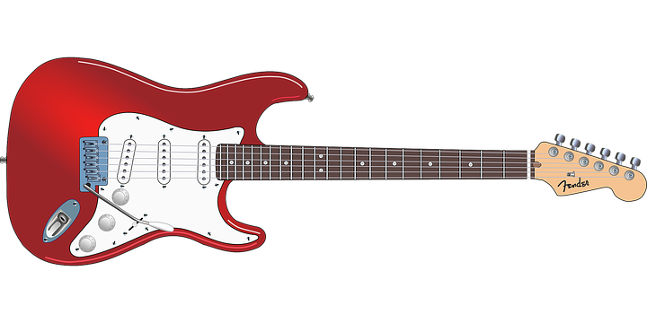

==========
Tecnologia
==========

Dopo l’invenzione della Corda e dell’Arpa nasce la chitarra elettrica
grazie il pick-up strumento utile che amplifica il suono facendolo
passare dalla semplice vibrazione di corde ad impulsi elettrici, ed è
un’evoluzione della chitarra classica

Fender
======
La Fender Musical Instruments Corporation è uno dei più famosi marchi
nel mondo dei costruttori di chitarre, bassi elettrici, piano elettrici
ed amplificatori, fondata nel 1946 da Leo Fender. La sua sede principale
è situata a **Scottsdale**, Arizona ed i principali siti di produzione
si trovano: **a Corona (California)**, OCONUS manufacturing facilities
in **Ensenada (Mexico), in Giappone, in Corea e in Cina** dove sono
prodotti gli strumenti della serie **Squier** e della nuova gamma
**"Fender Modern Player"**.Fender ricopre un ruolo importante per la sua
produzione di strumenti musicali a prezzi accessibili. La sua idea era
quella di colmare la distanza creatasi dalla difficoltà **di poter
reperire buoni strumenti musicali a basso costo** con il suo innovativo
progetto che si prestava ad una realizzazione industriale di serie. Le
campagne di comunicazione dell'epoca puntavano tutto sul fatto che
questi strumenti erano facilmente trasportabili e poco ingombranti,
specie le chitarre basso che andavano a sostituire gli enormi
contrabbassi, oltre che economici e affidabili e con un sound moderno
che ha aperto le porte della musica a migliaia di giovani musicisti in
erba.Nel corso degli anni la Fender si è espansa notevolmente,
inglobando nel suo gruppo industriale numerosi altri marchi, anche fra i
più prestigiosi della storia della liuteria americana E produce ogni
giorno **più di 2000 strumenti**.Nel 1985, la Fender Electric Instrument
Manufacturing Company è stata venduta ai suoi dipendenti ed ha cambiato
il suo nome in Fender Musical Instruments Corporation.La Fender spesso è
definita una chitarra forte, perché è adatta a musicisti **Rock o PunK**

Leo Fender
==========

Nome completo **Clarence Leonidas Fender** nato Anaheim, 10 agosto 1909,
è stato un liutaio statunitense, costruttore di bassi e chitarre
elettriche, insieme a Don Kaufmann e George Fullerton, è stato il
fondatore della Fender Musical Instruments Corporation.Fender fin da
molto piccolo si è interessato all’elettronica, subito dopo essersi
laureato in economia iniziò a fare il contabile allo *State of
California Highway Department* e successivamente avviò un'attività per
la riparazione di apparecchi radio,che nel 1947 fu ampliata con batterie
e chitarre Broadcaster che fu rapidamente ribattezzata **Telecaster**.
La Telecaster ha attirato l'interesse di nuove generazioni di
chitarristi. La costruzione separata di manico e corpo e la loro unione
per mezzo di viti hanno diminuito in modo significativo i costi di
produzione, rendendo accessibile a tutti l'acquisto di uno strumento di
qualità. Poi ci fu nel 1954 l’innovazione della **Stratocaster** con il
tremolo, grazie al quale si può avere un effetto innovativo.Nel 1965, in
cattive condizioni di salute, Fender vendette la sua *Fender Musical
Instruments Corporation* alla *Columbia Broadcasting Corporation* per 13
milioni di dollari.Nel 1970 egli lavorò per la Music Man e nel 1979
fondò la G&L con il suo vecchio amico George Fullerton, lavorò lì fino
alla sua morte, che lo colse il 21 marzo 1991 a causa di complicazioni
della malattia di Parkinson. Dal momento della sua morte, il suo ufficio
è rimasto intatto, una stanza vetrata in mezzo alla fabbrica con
quaderni e libri "aperti"; nessuno vi entra, solo persone selezionate,
per pulire, una volta al mese.

La chitarra è sempre stato uno strumento iconico, un esempio è
rappresentato da un quadro chiamato “\ **Il vecchio chitarrista cieco”**
dipinto da **Pablo Picasso** che diede inizio ad una nuova corrente
artistica chiamata il **Cubismo**.
